<div align="center">


<h1>
  
</h1>


<br/><br/>

<p align="center">
  
  
  
  
  
</p>
<p align="center">
  
  
  
  
  
</p>

</div>

---

## 🚨 Problem Statement

<table>
<tr>
<th>❌ Legacy System</th>
<th>✅ RecoverAI</th>
</tr>
<tr>
<td>Same retry logic for ALL failures</td>
<td>Context-aware ML per transaction</td>
</tr>
<tr>
<td>Ignores customer history & risk</td>
<td>Evaluates 26 behavioural signals</td>
</tr>
<tr>
<td>No compliance guardrails</td>
<td>Deterministic safety rules FIRST</td>
</tr>
<tr>
<td>Blind retries = fraud exposure</td>
<td>Guardrails block unsafe actions</td>
</tr>
<tr>
<td>No operator visibility</td>
<td>Real-time audit dashboard</td>
</tr>
</table>

## 💡 Solution

> **RecoverAI** is a **hybrid AI + deterministic rules** framework. Before the ML model touches a transaction, it must pass through an uncompromising guardrail engine. Only then does the CatBoost inference engine recommend the statistically optimal recovery action — logged instantly to an auditable SQLite database.

---

## ✨ Key Features

<table>
<tr>
<td width="33%">

**🧠 AI / ML Engine**
- CatBoost trained on **300,000 rows**
- **26 engineered features**
- AUC-ROC: **0.8207**
- Early stopping @ iteration **163**
- Native categorical feature support

</td>
<td width="33%">

**🛡️ Safety Guardrails**
- **5 strict rule-based overrides**
- Runs **BEFORE** ML model
- Blocks high-risk transactions
- Protects high-value payments
- Backs off excessive retries

</td>
<td width="33%">

**⚡ Production API**
- FastAPI + Uvicorn async stack
- Pydantic v2 validation
- **6 REST endpoints**
- Automated Swagger docs
- **< 150ms** end-to-end latency

</td>
</tr>
<tr>
<td>

**📊 Operator Dashboard**
- Real-time event polling
- SVG donut charts
- Action distribution stats
- Human override workflow
- Full audit trail

</td>
<td>

**🔄 CI/CD Pipeline**
- GitHub Actions on every push
- Auto model retraining
- Artifact upload (`*.cbm`)
- Zero manual steps

</td>
<td>

**🗃️ Audit & Monitoring**
- Full SQLite audit log
- Every decision recorded
- Operator approval tracking
- Feature importance exposed
- Policy explainability

</td>
</tr>
</table>

---

## 🔥 1. MASTER SYSTEM WORKFLOW

> Complete end-to-end animated pipeline — from raw transaction input to final audit log

<div align="center">
  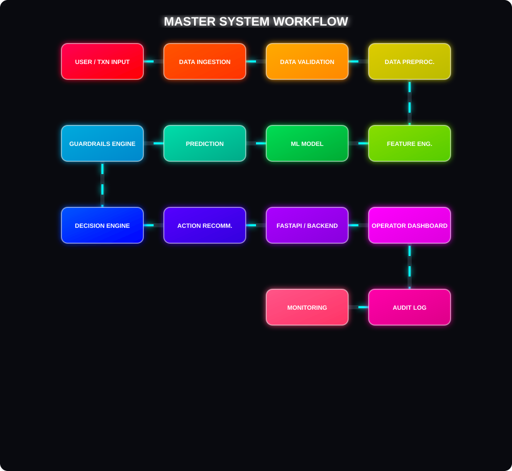
</div>

---

## 🧠 2. ADVANCED ML PIPELINE

> Every stage of the CatBoost training pipeline — from raw CSV to serialized model inference

<div align="center">
  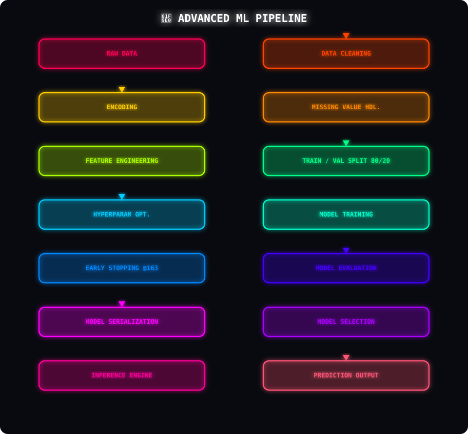
</div>

| Stage | Detail |
|---|---|
| **Training Rows** | 300,000 |
| **Validation Rows** | 60,000 (80/20 split) |
| **Algorithm** | CatBoostClassifier |
| **Iterations** | 500 (stopped at 163) |
| **Depth** | 7 |
| **Learning Rate** | 0.05 |
| **Loss Function** | Logloss |
| **Eval Metric** | AUC |

---

## 🏗️ 3. SYSTEM ARCHITECTURE

> 8-layer architecture — each layer communicates exclusively with adjacent layers

<div align="center">
  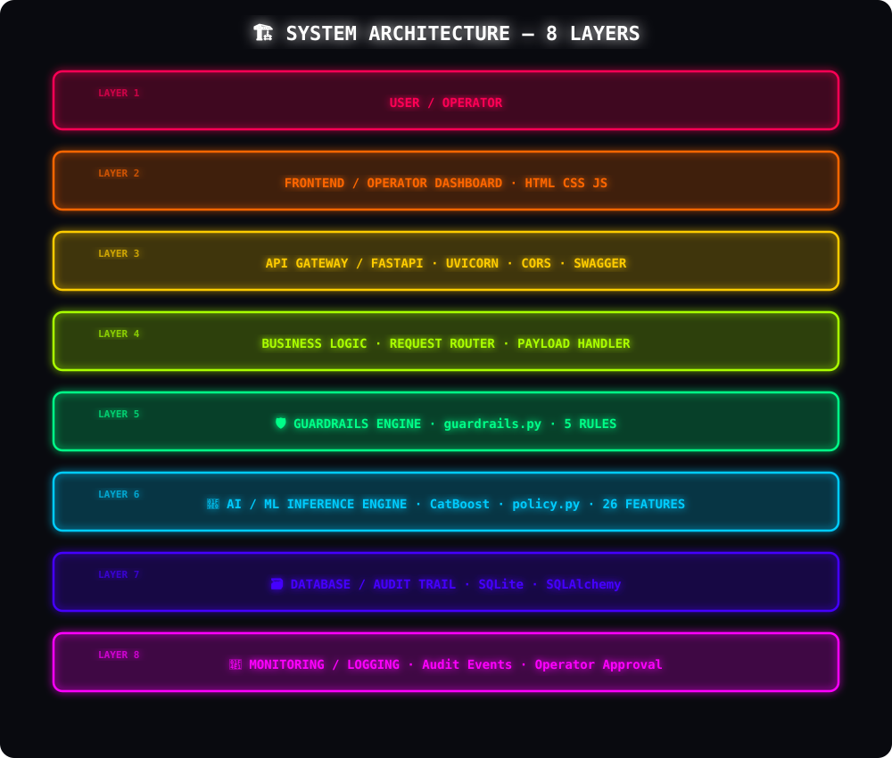
</div>

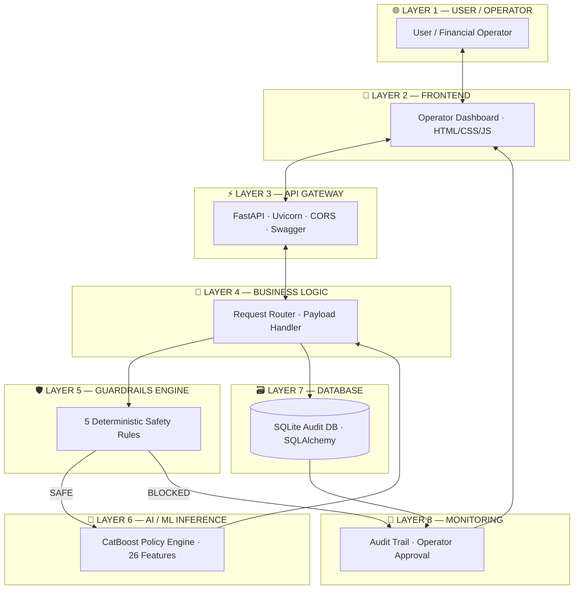

---

## 🛡️ 4. GUARDRAILS / AI SAFETY WORKFLOW

> Safety rules always evaluated BEFORE ML — no exceptions

<div align="center">
  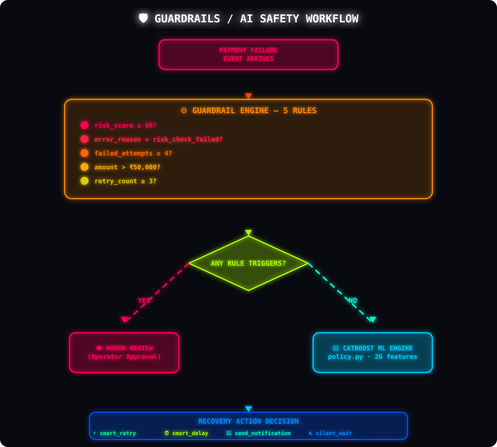
</div>

| Priority | Rule | Threshold | Override |
|:---:|---|---|:---:|
| 🔴 **1** | High Risk Score | `risk_score ≥ 80` | `human_review` |
| 🔴 **2** | Gateway Risk Check | `error_reason = risk_check_failed` | `human_review` |
| 🟠 **3** | Too Many Failures | `failed_attempts ≥ 4` | `human_review` |
| 🟠 **4** | High Value Transaction | `amount > ₹50,000` | `human_review` |
| 🟡 **5** | Excessive Retries | `retry_count ≥ 3` | `smart_delay` |
| ✅ **—** | All Pass | — | **→ ML Decides** |

---

## ⚡ 5. REAL-TIME INFERENCE FLOW

> A single failed transaction travels through the full stack in **< 150ms**

<div align="center">
  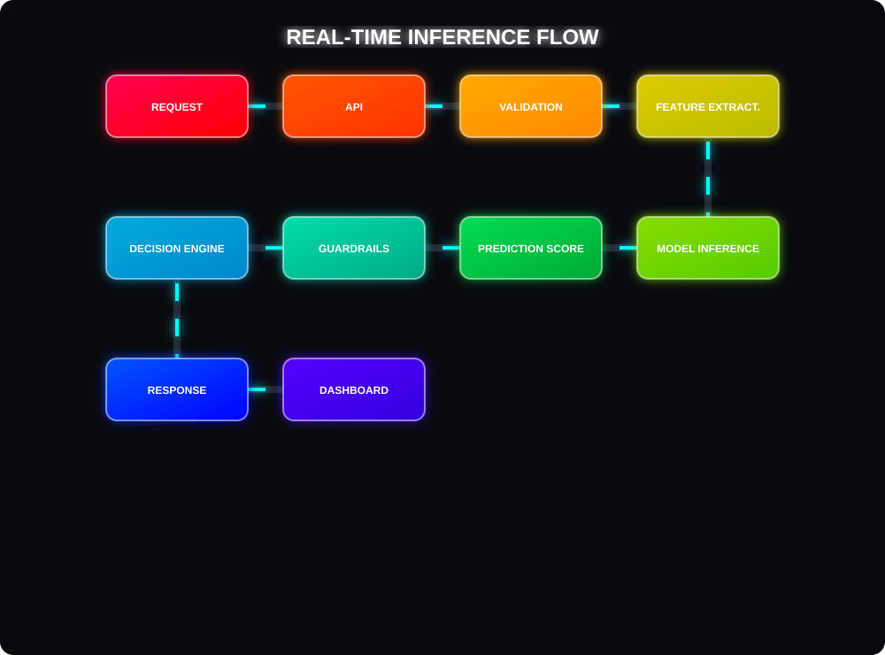
</div>

---

## 🔄 6. DATA FLOW ARCHITECTURE

<div align="center">
  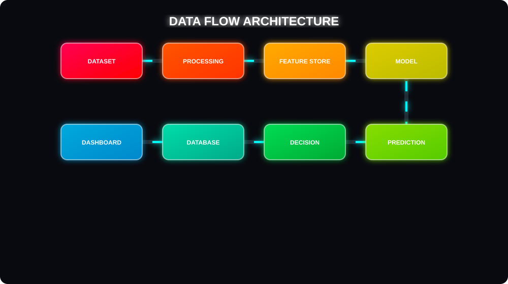
</div>

| Data Type | Travels Through |
|---|---|
| 🔴 Raw Transaction Data | Dataset → Preprocessing → Feature Store |
| 🟡 Engineered Features | Feature Store → CatBoost Model |
| 🔵 ML Predictions | Model → Decision Engine |
| 🟣 Audit Events | Decision → SQLite DB → Dashboard |

---

## 🌐 7. API ARCHITECTURE

> Request ↓ and Response ↑ streams visualized with rainbow color coding

<div align="center">
  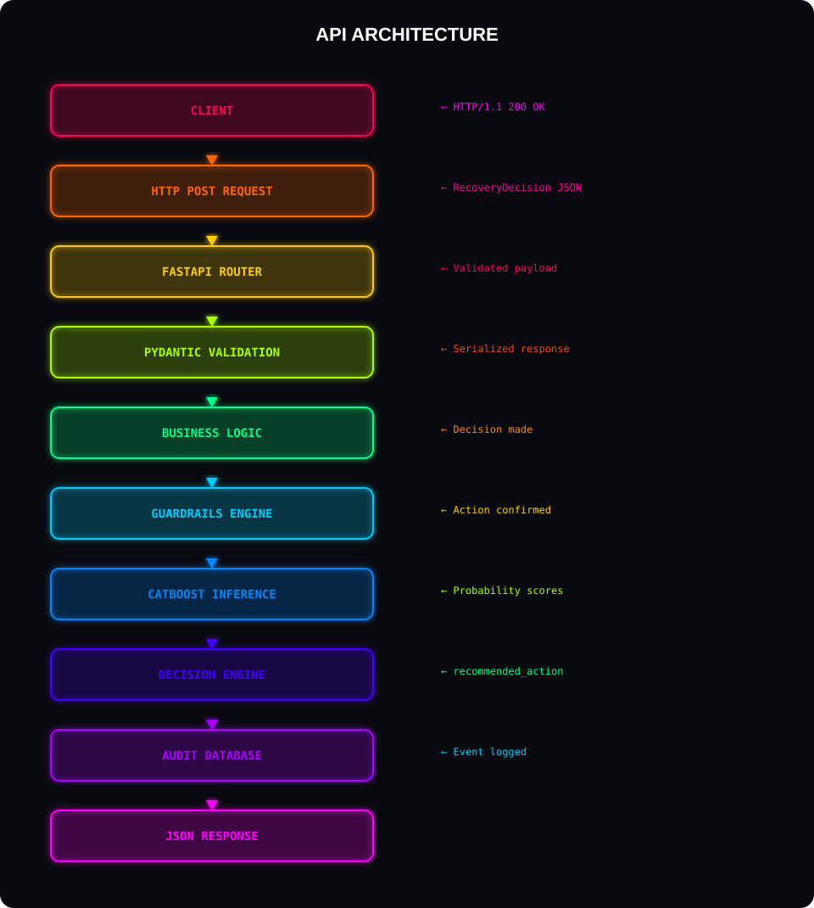
</div>

**All 6 Endpoints:**

| Method | Endpoint | Description |
|:---:|---|---|
| `POST` | `/api/process-payment` | Core ML inference · returns `RecoveryDecision` |
| `GET` | `/api/dashboard-stats` | Aggregate analytics for operator |
| `GET` | `/api/recent-events` | Last 50 audit records (newest first) |
| `POST` | `/api/approve-action` | Operator approval / rejection |
| `GET` | `/api/health` | Readiness probe + model status |
| `GET` | `/api/demo-event` | Pre-filled demo `PaymentEvent` |

---

## 📊 8. DASHBOARD WORKFLOW

<div align="center">
  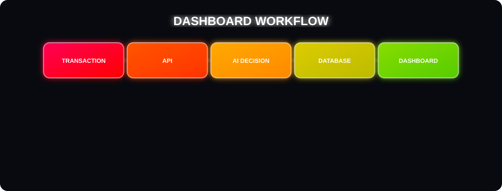
</div>

| Component | Data Source | Function |
|---|---|---|
| 🎯 Prediction Score | `/api/recent-events` | ML recovery probability |
| ⚖️ Recommended Action | `/api/recent-events` | Final decision |
| 🛡️ Guardrail Status | `/api/recent-events` | Was a rule triggered? |
| 📊 Action Distribution | `/api/dashboard-stats` | SVG donut chart |
| ✅ Operator Approval | `/api/approve-action` | Human review handler |
| ❤️ System Status | `/api/health` | Model loaded · DB connected |

---

## 🔐 9. SECURITY ARCHITECTURE

<div align="center">
  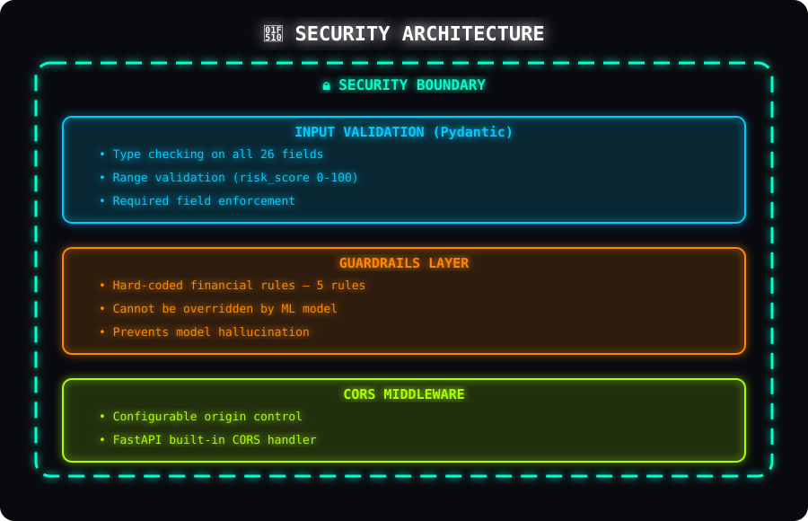
</div>

---

## 📡 10. MONITORING & AUDIT FLOW

<div align="center">
  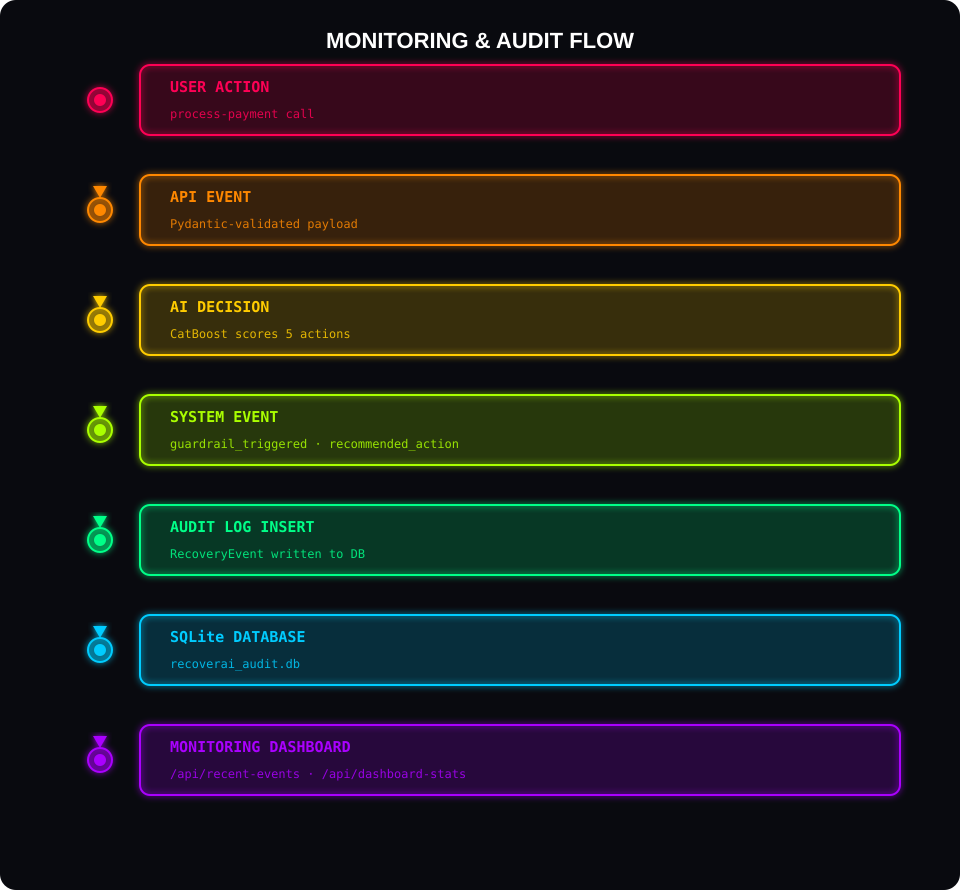
</div>

---

## 🤖 ML Model Details

### Training Configuration

```python
CatBoostClassifier(
    iterations            = 500,       # → stopped at 163
    learning_rate         = 0.05,
    depth                 = 7,
    l2_leaf_reg           = 3,
    loss_function         = "Logloss",
    eval_metric           = "AUC",
    early_stopping_rounds = 50,
    task_type             = "CPU",
    thread_count          = -1,
)
```

### 26 Features Used

| Category | Features |
|---|---|
| **Transaction** | `amount`, `payment_method`, `error_reason`, `card_type`, `merchant_category`, `amount_bucket` |
| **Customer** | `customer_segment`, `customer_age`, `account_balance`, `customer_tenure_months`, `previous_failed_attempts` |
| **Behaviour** | `retry_count`, `risk_score`, `recovery_attempt_count`, `transaction_frequency_30d`, `time_since_last_failure_hr` |
| **Context** | `bank`, `region`, `device_type`, `channel`, `hour_of_day`, `day_of_week`, `is_weekend` |
| **Notifications** | `notification_sent`, `opt_out_notification`, `treatment_action` |

---

## 🎯 Evaluation Metrics

| Metric | Score |
|:---:|:---:|
| 📈 **AUC-ROC** | **0.8207** |
| 🎯 **Accuracy** | **74.43%** |
| 🔍 **Precision** | **0.7662** |
| ⚖️ **F1 Score** | **0.7408** |
| 🔁 **Recall** | **0.7169** |
| 🛑 **Best Iteration** | **163 / 500** |
| 🗂️ **Training Rows** | **300,000** |
| 🧪 **Validation Rows** | **60,000** |
| 🔢 **Features** | **26** |

---

## ⚖️ Decision Engine — 5 Recovery Actions

| Action | When Used | Risk |
|---|---|:---:|
| ⚡ `smart_retry` | High recovery probability · low risk · transient error | 🟢 Low |
| ⏰ `smart_delay` | Too many retries · needs backoff | 🟡 Medium |
| 📩 `send_notification` | Customer must act (update card, etc.) | 🟡 Medium |
| 🔇 `silent_wait` | System issue expected to self-resolve | 🟢 Low |
| 👁️ `human_review` | High risk · fraud flag · high-value | 🔴 High |

---

## 💻 Tech Stack

| Layer | Technology |
|---|---|
| 🧠 **ML Model** | CatBoost · Scikit-learn · Pandas · NumPy |
| ⚡ **Backend API** | Python 3.11 · FastAPI · Uvicorn |
| 📋 **Data Models** | Pydantic v2 |
| 🗃️ **Database** | SQLite · SQLAlchemy |
| 🎨 **Frontend** | HTML5 · CSS3 · Vanilla JS |
| 🔄 **CI/CD** | GitHub Actions |

---

## 📂 Project Structure

```text
AI-Revenue-recovery-421/
│
├── 📄 README.md
├── 📄 LICENSE
│
├── 🤖 train_catboost.py
├── 🔧 build_recoverai_dataset.py
├── 📥 download_datasets.py
├── 📊 eda_analysis.py
├── 🚀 run.py  ·  start.bat
│
├── 🧠 model/
│   ├── recoverai_catboost.cbm     ← 420 KB trained model
│   ├── metrics.json
│   └── feature_importance.csv
│
├── 🔌 backend/
│   ├── main.py         ← FastAPI · 6 endpoints
│   ├── models.py       ← Pydantic schemas
│   ├── guardrails.py   ← 5-rule safety engine
│   ├── policy.py       ← CatBoost inference
│   ├── database.py     ← SQLite audit trail
│   └── requirements.txt
│
├── 🎨 frontend/
│   ├── index.html  ·  app.js  ·  style.css
│
└── 🖼️  assets/
    ├── 1_master_workflow.svg
    ├── 2_ml_pipeline.svg
    ├── 3_system_architecture.svg
    ├── 4_guardrails_safety.svg
    ├── 5_inference_flow.svg
    ├── 6_data_flow.svg
    ├── 7_api_arch.svg
    ├── 8_dashboard_flow.svg
    ├── 9_security_arch.svg
    └── 10_monitoring_flow.svg
```

---

## 🚀 Quick Start

```bash
# 1. Clone
git clone https://github.com/viRAJ357/RecoverAI-Guardrails.git
cd RecoverAI-Guardrails

# 2. Install
pip install -r backend/requirements.txt

# 3. Start server
cd backend
uvicorn main:app --reload --host 0.0.0.0 --port 8000

# 4. Dashboard → http://localhost:8000
# 5. API Docs  → http://localhost:8000/docs
```

---

## 📥 Example Request

```bash
curl -X POST http://localhost:8000/api/process-payment \
  -H "Content-Type: application/json" \
  -d '{
    "transaction_id": "TXN-2024-98765",
    "amount": 1499.0,
    "payment_method": "upi",
    "error_reason": "insufficient_funds",
    "customer_segment": "premium",
    "risk_score": 22.0,
    "retry_count": 1,
    "failed_attempts": 1
  }'
```

## 📤 Example Response

```json
{
  "transaction_id": "TXN-2024-98765",
  "recommended_action": "send_notification",
  "recovery_probability": 0.847,
  "guardrail_triggered": false,
  "guardrail_reason": null,
  "all_action_scores": {
    "smart_retry": 0.18,
    "smart_delay": 0.12,
    "send_notification": 0.847,
    "silent_wait": 0.09,
    "human_review": 0.04
  }
}
```

---

## 🏭 Production-Grade Features

| Feature | Detail |
|---|---|
| ✅ Idempotency | Webhook retries handled safely |
| ✅ Fail-safe | Deterministic fallback if model unavailable |
| ✅ Async | FastAPI `async def` routes for concurrency |
| ✅ Type Safety | Pydantic v2 enforces all 26 input fields |
| ✅ Auditability | Every decision logged before response |
| ✅ CI/CD | Auto model retraining on every push |

---

## 🔮 Future Improvements

- 🔗 **RAG Integration** — LLM-generated policy explanations per decision
- 🐘 **PostgreSQL Migration** — For distributed, high-availability deployments
- 🚦 **Redis Rate Limiting** — Global retry throttle across distributed workers
- 🔔 **Razorpay Webhook** — Live payment gateway integration
- 📱 **Mobile Dashboard** — Responsive operator interface

---

## 👥 Team & Submission

| Field | Details |
|---|---|
| **Project** | RecoverAI — Intelligent Payment Recovery |
| **Repository** | [github.com/viRAJ357/RecoverAI-Guardrails](https://github.com/viRAJ357/RecoverAI-Guardrails) |
| **Model AUC** | 0.8207 |
| **Dataset** | 300,000 training rows |
| **Hackathon** | National Level Submission |
| **License** | MIT |

---

<div align="center">


**Built with ❤️ for the National Level Hackathon**

*RecoverAI — Turning failed transactions into recovered revenue.*

</div>