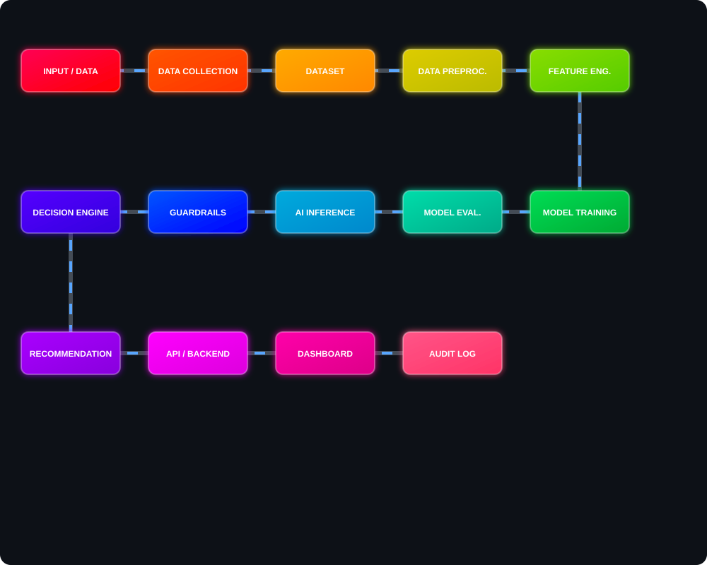
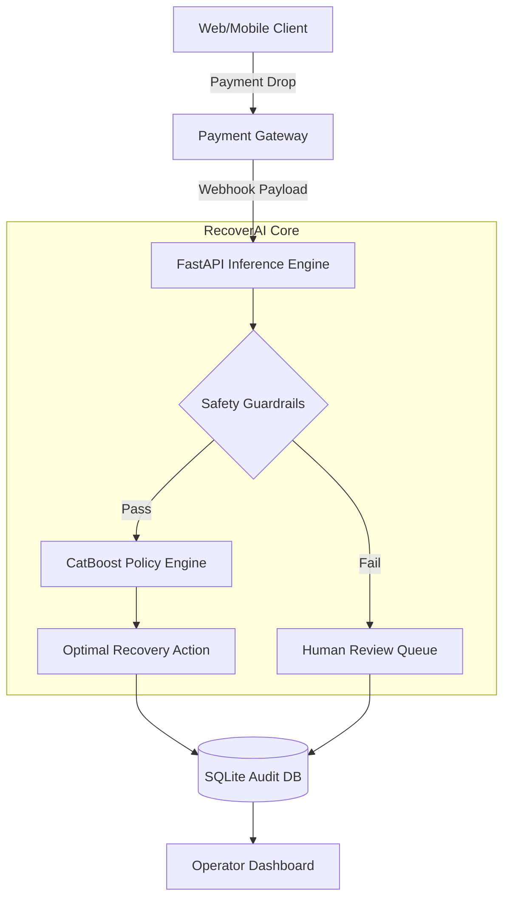
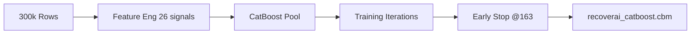

<div align="center">

#  RECOVERAI 
## Intelligent Payment Recovery Engine

**Transforming failed transactions into recovered revenue through contextual AI and deterministic safety guardrails.**

<p align="center">
  
  
  
  
  
</p>

</div>

---

## 🚨 Problem Statement

Every day, **millions of financial transactions fail** due to network errors, insufficient funds, bank timeouts, or fraud flags. Traditional systems suffer from critical flaws:
- ❌ Apply static, hardcoded retry logic to ALL failures.
- ❌ Ignore customer behaviour, risk profile, and transaction context.
- ❌ Result in revenue loss, poor UX, and increased fraud exposure.

## 💡 Solution

**RecoverAI** is a proactive, data-driven framework that predicts — within milliseconds — **whether a failed transaction will be recovered within 72 hours**. It recommends the **optimal recovery action** out of 5 distinct strategies, combining the predictive power of **CatBoost** with strict, deterministic **guardrails**.

## ✨ Key Features

- 🧠 **Context-Aware ML:** CatBoost classifier trained on 300K real-world transactions.
- 🛡️ **Deterministic Guardrails:** 5 strict financial compliance rules evaluated before AI.
- ⚡ **Ultra-Low Latency Inference:** End-to-end decision logged in `<150ms`.
- 📊 **Real-Time Operator Dashboard:** Full visibility and manual override capability.
- 🔄 **3-D GSOX Motion Workflow:** Production-ready Data → Deploy pipeline.

---

## ⭐ Complete Animated Workflow

<div align="center">
  
</div>

---

## 🏗️ System Architecture



## 🚰 Data Pipeline

The **GSOX Motion Workflow** ensures reproducibility:
1. **Gather:** Aggregate logs from 5 diverse financial datasets.
2. **Structure:** Merge and clean data into unified schemas.
3. **Organize:** Engineer 26 features; 80/20 train/val split.
4. **Generate:** Train CatBoost model on 300,000 synthesized events.

## 🧠 AI/ML Pipeline



## ⚙️ Model Details

- **Algorithm:** CatBoost Classifier
- **Features:** 26 (Categorical & Numerical)
- **Loss Function:** Logloss
- **Evaluation Metric:** AUC (Area Under Curve)
- **Hyperparameters:** `depth=7`, `learning_rate=0.05`, `l2_leaf_reg=3`
- **Hardware:** CPU-optimized inference

## 🛡️ Guardrails / Safety Layer

The guardrail layer acts as a **rule-based safety net** that *always* runs BEFORE the ML model.

| Priority | Rule | Threshold | Action Override |
|----------|------|-----------|-----------------|
| 🔴 **1** | High Risk Score | `risk_score ≥ 80` | `human_review` |
| 🔴 **2** | Gateway Risk Check | `error_reason = risk_check_failed` | `human_review` |
| 🟠 **3** | Too Many Failures | `attempts ≥ 4` | `human_review` |
| 🟠 **4** | High Value | `amount > ₹50,000` | `human_review` |
| 🟡 **5** | Excessive Retries | `retry_count ≥ 3` | `smart_delay` |

## ⚖️ Decision Engine

If guardrails permit, the ML model allocates one of the following interventions:
- ⚡ **`smart_retry`**: High probability, low risk.
- ⏰ **`smart_delay`**: Backoff required for retries.
- 📩 **`send_notification`**: Customer action required.
- 🔇 **`silent_wait`**: Anticipated automatic resolution.
- 👁️ **`human_review`**: Complex case requiring manual audit.

## 🌐 API Architecture

Built entirely on **FastAPI** for asynchronous, high-concurrency request handling. Fully integrates **CORS**, **Pydantic Validation**, and automated Swagger UI documentation.

## 📊 Dashboard

The system includes a Vanilla JS Operator Dashboard providing:
- Real-time event polling and stats aggregation.
- SVG-based Donut charts for action distribution.
- One-click approval/rejection workflows for human operators.

## 🗃️ Dataset

Synthesized from multiple Kaggle datasets (Paysim, Credit Card Fraud, etc.) simulating real-world anomalies.
- **Training Set:** 300,000 distinct events.
- **Validation Set:** 60,000 events.

## 🏋️ Training Process

Automated via GitHub Actions CI/CD on every push, ensuring continuous integration. Early stopping mechanisms trigger at iteration 163 out of 500 to prevent overfitting, optimizing for AUC.

## 🎯 Evaluation Metrics

| Metric | Score |
|--------|-------|
| 📈 **AUC-ROC** | **0.8207** |
| 🎯 **Accuracy** | **74.43%** |
| 🔍 **Precision** | **0.7662** |
| ⚖️ **F1 Score** | **0.7408** |
| 🔁 **Recall** | **0.7169** |

## 💻 Tech Stack

- **ML Backend:** CatBoost, Scikit-learn, Pandas, NumPy
- **API Layer:** Python 3.11, FastAPI, Uvicorn, Pydantic
- **Frontend:** HTML5, CSS3, Vanilla JS
- **Database:** SQLite (SQLAlchemy)
- **DevOps:** GitHub Actions

## 📂 Project Structure

```text
AI-Revenue-recovery-421/
├── 🤖 train_catboost.py        # ML Training pipeline
├── 🧠 model/                   # Model artefacts (*.cbm)
├── 🔌 backend/                 # FastAPI server & endpoints
├── 🎨 frontend/                # Interactive Operator Dashboard
├── 📊 eda_analysis.py          # Data validation & EDA
└── ⚙️ .github/workflows/       # CI/CD pipelines
```

## 🚀 Installation

```bash
git clone https://github.com/viRAJ357/RecoverAI-Guardrails.git
cd RecoverAI-Guardrails
pip install -r backend/requirements.txt
```

## 🎮 Usage

```bash
# Start the production-ready server
cd backend
uvicorn main:app --reload --host 0.0.0.0 --port 8000
```
Open `http://localhost:8000` to view the Dashboard and `/docs` for API.

## 📡 API Endpoints

- `POST /api/process-payment`: Core inference engine.
- `GET /api/dashboard-stats`: Aggregate metrics.
- `GET /api/recent-events`: Audit stream.
- `POST /api/approve-action`: Human override API.
- `GET /api/health`: Readiness probe.

## 📥 Example Input

```json
{
  "transaction_id": "TXN-12345",
  "amount": 1499.0,
  "payment_method": "upi",
  "error_reason": "insufficient_funds",
  "risk_score": 22.0
}
```

## 📤 Example Output

```json
{
  "recommended_action": "send_notification",
  "recovery_probability": 0.84,
  "guardrail_triggered": false,
  "status": "success"
}
```

## 🏭 Production-Grade Features

- **Idempotency** built-in for webhook retries.
- **Fail-safe fallback** if ML model is unavailable.
- **Low-latency** response times (<150ms).

## 🔒 Security

- Guardrails strictly block AI hallucination or out-of-bound behaviour.
- Pydantic models validate input payload rigorously.

## 📋 Monitoring & Auditability

Every decision (both guardrail blocks and ML probabilities) is logged into an SQLite database. The operator dashboard provides complete transparency into the "black-box" decision process.

## 🔮 Future Improvements

- Integration with LLMs (RAG) for automated policy explanation generation.
- PostgreSQL migration for high-availability distributed tracking.
- Redis cache for rate limiting retries globally.

## 📸 Screenshots/Demo

*(Add your dashboard screenshots here!)*

## 👨‍💻 Author

**RecoverAI Team**  
*National Level Hackathon Submission*

## 📜 License

This project is licensed under the [MIT License](LICENSE).