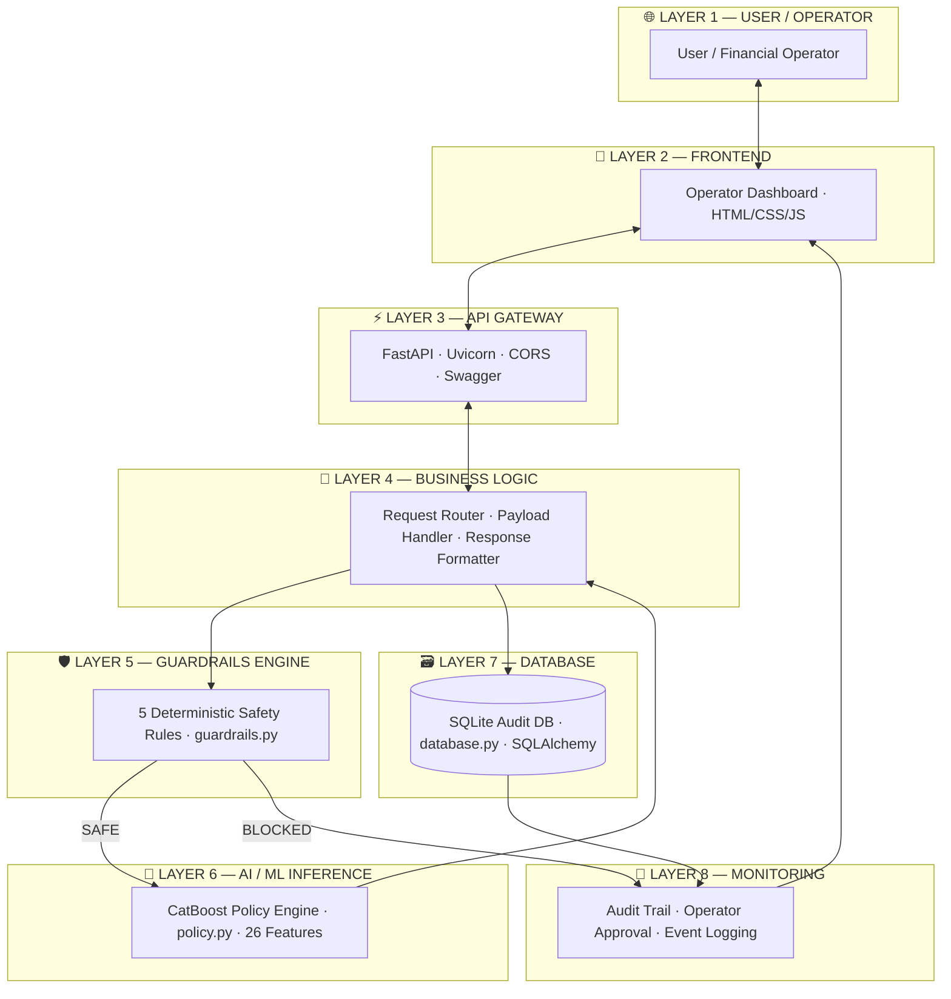

<div align="center">


# ⚡ RecoverAI — Guardrails-Driven AI Payment Recovery

<h3><em>Turning failed transactions into recovered revenue · AI + Safety Rules · < 150ms inference</em></h3>

<br/>

<p align="center">
  
  
  
  
  
  
  
  
  
  
</p>

</div>

---

## 🚨 Problem Statement

Every day, **millions of digital transactions fail** — network timeouts, insufficient funds, bank risk engines, fraud flags. Traditional recovery systems are dangerously naive:

| Legacy System | RecoverAI |
|---|---|
| ❌ Same retry logic for ALL failures | ✅ Context-aware ML per transaction |
| ❌ Ignores customer history & risk | ✅ Evaluates 26 behavioural signals |
| ❌ No compliance guardrails | ✅ Deterministic safety rules first |
| ❌ Blind retries = fraud exposure | ✅ Guardrails block unsafe actions |
| ❌ No operator visibility | ✅ Real-time audit dashboard |

## 💡 Solution Architecture

> **RecoverAI** is a **hybrid AI + deterministic rules** framework. Before the ML model touches a transaction, it must pass through an uncompromising guardrail engine. Only then does the CatBoost inference engine recommend the statistically optimal recovery action — logged instantly to an auditable SQLite database.

---

## ✨ Key Features

<table>
<tr>
<td width="33%">

**🧠 AI / ML Engine**
- CatBoost trained on 300K rows
- 26 engineered features
- AUC-ROC: 0.8207
- Early stopping @ iteration 163
- Native categorical feature support

</td>
<td width="33%">

**🛡️ Safety Guardrails**
- 5 strict rule-based overrides
- Runs BEFORE ML model
- Blocks high-risk transactions
- Protects high-value payments
- Backs off excessive retries

</td>
<td width="33%">

**⚡ Production API**
- FastAPI + Uvicorn async stack
- Pydantic v2 validation
- 6 REST endpoints
- Automated Swagger docs
- < 150ms end-to-end latency

</td>
</tr>
<tr>
<td>

**📊 Operator Dashboard**
- Real-time polling
- SVG donut charts
- Action distribution stats
- Human override workflow
- Full audit trail

</td>
<td>

**🔄 CI/CD Pipeline**
- GitHub Actions on every push
- Auto model training
- Artifact upload (*.cbm)
- Zero manual steps

</td>
<td>

**🗃️ Audit & Monitoring**
- Full SQLite audit log
- Every decision recorded
- Operator approval tracking
- Feature importance exposed
- Policy explainability

</td>
</tr>
</table>

---

## 🔥 1. MASTER SYSTEM WORKFLOW

> Complete end-to-end animated pipeline — from raw transaction input to final audit log

<div align="center">
  
</div>

<div align="center">

```
USER / TXN INPUT  →  DATA INGESTION  →  DATA VALIDATION  →  DATA PREPROCESSING
       ↓                                                              ↓
  MONITORING     ←   AUDIT LOG    ←   OPERATOR DASHBOARD   ←   FEATURE ENGINEERING
       ↑                                                              ↓
  FASTAPI/API    →  ACTION RECOMM.  →  DECISION ENGINE  →   GUARDRAILS ENGINE
                                                                      ↓
                                                              ML MODEL → PREDICTION
```

</div>

---

## 🧠 2. ADVANCED ML PIPELINE

> Every stage of the CatBoost training pipeline — from raw CSV to serialized model

<div align="center">
  
</div>

```
                          ML PIPELINE — 300,000 Rows → 0.8207 AUC
╔════════════════════════════════════════════════════════════════════════╗
║  RAW DATA → DATA CLEANING → MISSING VALUE HDL. → ENCODING            ║
║      ↓                                                                ║
║  FEATURE ENGINEERING → TRAIN/VAL SPLIT (80/20)                       ║
║      ↓                                                                ║
║  MODEL TRAINING (CatBoost, iterations=500, depth=7, lr=0.05)         ║
║      ↓                                                                ║
║  EARLY STOPPING → stopped @ iteration 163                             ║
║      ↓                                                                ║
║  MODEL EVALUATION → AUC=0.8207 · Acc=74.43% · F1=0.7408             ║
║      ↓                                                                ║
║  MODEL SERIALIZATION → recoverai_catboost.cbm                        ║
║      ↓                                                                ║
║  INFERENCE → PREDICTION                                               ║
╚════════════════════════════════════════════════════════════════════════╝
```

---

## 🏗️ 3. SYSTEM ARCHITECTURE

> Layered architecture — each layer communicates exclusively with adjacent layers

<div align="center">
  
</div>



---

## 🛡️ 4. GUARDRAILS / AI SAFETY WORKFLOW

> Safety rules always run BEFORE ML. No exceptions.

<div align="center">
  
</div>

```
                    ┌─────────────────────────────────┐
                    │         PAYMENT FAILURE          │
                    │          EVENT ARRIVES           │
                    └────────────────┬────────────────┘
                                     │
                    ┌────────────────▼────────────────┐
                    │    GUARDRAIL ENGINE — 5 RULES    │
                    ├─────────────────────────────────┤
                    │  🔴 risk_score ≥ 80?             │
                    │  🔴 error_reason = risk_check?   │
                    │  🟠 failed_attempts ≥ 4?         │
                    │  🟠 amount > ₹50,000?            │
                    │  🟡 retry_count ≥ 3?             │
                    └────────────────┬────────────────┘
                                     │
                    ┌────────────────▼────────────────┐
                    │         ANY RULE TRIGGERS?       │
                    └──────┬────────────────┬─────────┘
                           │ YES            │ NO
              ┌────────────▼───┐    ┌───────▼──────────────┐
              │  HUMAN REVIEW  │    │  CATBOOST ML ENGINE   │
              │   (Operator    │    │  policy.py · 26 feat. │
              │    Approval)   │    └───────────┬───────────┘
              └────────────────┘               │
                                    ┌──────────▼──────────┐
                                    │   RECOVERY ACTION   │
                                    │ smart_retry /       │
                                    │ smart_delay /       │
                                    │ send_notification / │
                                    │ silent_wait         │
                                    └─────────────────────┘
```

| Priority | Rule | Threshold | Override Action |
|:---:|---|---|:---:|
| 🔴 **1** | High Risk Score | `risk_score ≥ 80` | `human_review` |
| 🔴 **2** | Gateway Risk Check | `error_reason = risk_check_failed` | `human_review` |
| 🟠 **3** | Too Many Failures | `failed_attempts ≥ 4` | `human_review` |
| 🟠 **4** | High Value Transaction | `amount > ₹50,000` | `human_review` |
| 🟡 **5** | Excessive Retries | `retry_count ≥ 3` | `smart_delay` |
| ✅ **—** | All Pass | — | **→ ML Decides** |

---

## ⚡ 5. REAL-TIME INFERENCE FLOW

> A single transaction request travels through the full stack in < 150ms

<div align="center">
  
</div>

```
  ⏱ < 150ms END-TO-END
  ─────────────────────────────────────────────────────────────────
  REQUEST → FASTAPI ROUTER → PYDANTIC VALIDATION → FEATURE EXTRACT
                                                           ↓
  DASHBOARD ← AUDIT LOG ← RESPONSE ← DECISION ENGINE ← GUARDRAILS
                                             ↓
                                    CATBOOST INFERENCE
                                    (26 features → prob.)
  ─────────────────────────────────────────────────────────────────
```

---

## 🔄 6. DATA FLOW ARCHITECTURE

<div align="center">
  
</div>

| Data Type | Color Code | Travels Through |
|---|---|---|
| 🔴 Raw Transaction Data | Red → Orange | Dataset → Preprocessing → Feature Store |
| 🟡 Engineered Features | Yellow → Green | Feature Store → CatBoost Model |
| 🔵 ML Predictions | Cyan → Blue | Model → Decision Engine |
| 🟣 Audit Events | Purple → Magenta | Decision → SQLite DB → Dashboard |

---

## 🌐 7. API ARCHITECTURE

> Request and response streams flow simultaneously through the stack

<div align="center">
  
</div>

```
CLIENT
  │ POST /api/process-payment
  ▼
FASTAPI (main.py)
  │ Async route handler
  ▼
PYDANTIC VALIDATION (models.py)
  │ PaymentEvent schema · 26 fields · type-checked
  ▼
BUSINESS LOGIC
  │ orchestrates guardrails → ML → response
  ▼
GUARDRAILS ENGINE (guardrails.py)
  │ 5 rules evaluated deterministically
  ▼
CATBOOST INFERENCE (policy.py)
  │ model.predict_proba(features) → argmax(action_scores)
  ▼
AUDIT DATABASE (database.py)
  │ SQLAlchemy · RecoveryEvent inserted
  ▼
JSON RESPONSE → RecoveryDecision {
    recommended_action,
    recovery_probability,
    guardrail_triggered,
    all_action_scores
}
```

**All 6 Endpoints:**

| Method | Endpoint | Description |
|:---:|---|---|
| `POST` | `/api/process-payment` | Core ML inference · returns `RecoveryDecision` |
| `GET` | `/api/dashboard-stats` | Aggregate analytics for operator |
| `GET` | `/api/recent-events` | Last 50 audit records (newest first) |
| `POST` | `/api/approve-action` | Operator approval / rejection |
| `GET` | `/api/health` | Readiness probe + model status |
| `GET` | `/api/demo-event` | Pre-filled demo `PaymentEvent` |

---

## 📊 8. DASHBOARD WORKFLOW

<div align="center">
  
</div>

The operator dashboard polls the backend and renders:

| Component | Data Source | Function |
|---|---|---|
| 🎯 Prediction Score | `/api/recent-events` | ML recovery probability |
| ⚖️ Recommended Action | `/api/recent-events` | Final decision (retry/notify/wait/human) |
| 🛡️ Guardrail Status | `/api/recent-events` | Was a rule triggered? |
| 📊 Action Distribution | `/api/dashboard-stats` | SVG donut chart breakdown |
| ✅ Operator Approval | `/api/approve-action` | One-click human_review handler |
| ❤️ System Status | `/api/health` | Model loaded · DB connected |

---

## 🔐 9. SECURITY ARCHITECTURE

<div align="center">
  
</div>

```
┌─────────────────────────────────────┐
│          SECURITY BOUNDARY          │
│                                     │
│  INPUT VALIDATION (Pydantic)        │
│    • Type checking on all 26 fields │
│    • Range validation               │
│    • Required field enforcement     │
│                                     │
│  GUARDRAILS LAYER                   │
│    • Hard-coded financial rules     │
│    • Cannot be overridden by ML     │
│    • Prevents model hallucination   │
│                                     │
│  CORS MIDDLEWARE                    │
│    • Configurable origin control    │
│                                     │
└─────────────────────────────────────┘
```

---

## 📡 10. MONITORING & AUDIT FLOW

<div align="center">
  
</div>

> Every single decision — ML or guardrail — is written to the audit trail before the response is returned.

```
USER ACTION (process-payment)
       ↓
API EVENT → Pydantic-validated payload
       ↓
AI DECISION → CatBoost scores all 5 actions
       ↓
SYSTEM EVENT → guardrail_triggered · recommended_action
       ↓
AUDIT LOG INSERT → RecoveryEvent {
    transaction_id, amount, action,
    probability, guardrail_triggered,
    operator_decision, timestamp
}
       ↓
SQLite DATABASE
       ↓
MONITORING DASHBOARD ← /api/recent-events · /api/dashboard-stats
```

---

## 🤖 ML Model Details

### Training Configuration
```python
CatBoostClassifier(
    iterations          = 500,
    learning_rate       = 0.05,
    depth               = 7,
    l2_leaf_reg         = 3,
    loss_function       = "Logloss",
    eval_metric         = "AUC",
    early_stopping_rounds = 50,
    task_type           = "CPU",
    thread_count        = -1,    # All cores
)
# Stopped at iteration 163 / 500 (early stopping)
```

### 26 Features Used

| Category | Features |
|---|---|
| **Transaction** | `amount`, `payment_method`, `error_reason`, `card_type`, `merchant_category`, `amount_bucket` |
| **Customer** | `customer_segment`, `customer_age`, `account_balance`, `customer_tenure_months`, `previous_failed_attempts` |
| **Behaviour** | `retry_count`, `risk_score`, `recovery_attempt_count`, `transaction_frequency_30d`, `time_since_last_failure_hr` |
| **Context** | `bank`, `region`, `device_type`, `channel`, `hour_of_day`, `day_of_week`, `is_weekend` |
| **Notifications** | `notification_sent`, `opt_out_notification`, `treatment_action` |

---

## 🎯 Evaluation Metrics

<div align="center">

| Metric | Score | Description |
|:---:|:---:|---|
| 📈 **AUC-ROC** | **0.8207** | Primary discriminatory power metric |
| 🎯 **Accuracy** | **74.43%** | Overall prediction correctness |
| 🔍 **Precision** | **0.7662** | Positive prediction reliability |
| ⚖️ **F1 Score** | **0.7408** | Harmonic mean of precision & recall |
| 🔁 **Recall** | **0.7169** | True positive coverage |
| 🛑 **Best Iteration** | **163 / 500** | Early stopping applied |
| 🗂️ **Training Rows** | **300,000** | Synthesized from 5 Kaggle datasets |
| 🧪 **Validation Rows** | **60,000** | 80/20 split |
| 🔢 **Features** | **26** | Categorical + Numerical |

</div>

---

## ⚖️ Decision Engine — 5 Recovery Actions

| Action | When Used | Risk Level |
|---|---|:---:|
| ⚡ `smart_retry` | High recovery probability · low risk · transient error | 🟢 Low |
| ⏰ `smart_delay` | Too many retries already · space out attempts | 🟡 Medium |
| 📩 `send_notification` | Customer must act (e.g. update card) | 🟡 Medium |
| 🔇 `silent_wait` | System issue expected to self-resolve | 🟢 Low |
| 👁️ `human_review` | High risk · fraud flag · high-value transaction | 🔴 High |

---

## 🏭 Production-Grade Features

- ✅ **Idempotency** — Webhook retries handled safely
- ✅ **Fail-safe** — Deterministic fallback if model unavailable
- ✅ **Async** — FastAPI `async def` routes for concurrency
- ✅ **Type Safety** — Pydantic v2 enforces all 26 input fields
- ✅ **Auditability** — Every decision logged before response sent
- ✅ **CI/CD** — Zero-manual model retraining on every push

---

## 💻 Tech Stack

| Layer | Technology |
|---|---|
| 🧠 **ML Model** | CatBoost · Scikit-learn · Pandas · NumPy |
| ⚡ **Backend API** | Python 3.11 · FastAPI · Uvicorn |
| 📋 **Data Models** | Pydantic v2 |
| 🗃️ **Database** | SQLite · SQLAlchemy |
| 🎨 **Frontend** | HTML5 · CSS3 · Vanilla JS |
| 🔄 **CI/CD** | GitHub Actions |

---

## 📂 Project Structure

```text
AI-Revenue-recovery-421/
│
├── 📄 README.md                        ← You are here
├── 📄 LICENSE                          ← MIT
├── 📄 .gitignore
│
├── 🤖 train_catboost.py               ← Model training pipeline (6 steps)
├── 🔧 build_recoverai_dataset.py      ← Dataset engineering (300K rows)
├── 📥 download_datasets.py            ← Kaggle dataset downloader
├── 📊 eda_analysis.py                 ← Full EDA with visualisations
├── 📊 eda_fast.py                     ← Fast EDA (console only)
├── 🚀 run.py                          ← One-command server launcher
├── 🖥️  start.bat                       ← Windows batch launcher
│
├── 🧠 model/
│   ├── recoverai_catboost.cbm         ← Trained model (420 KB)
│   ├── metrics.json                   ← Evaluation results
│   └── feature_importance.csv         ← Feature ranking
│
├── 🔌 backend/
│   ├── main.py                        ← FastAPI app · 6 endpoints
│   ├── models.py                      ← Pydantic schemas
│   ├── guardrails.py                  ← 5-rule safety engine
│   ├── policy.py                      ← CatBoost inference engine
│   ├── database.py                    ← SQLite audit trail
│   └── requirements.txt              ← Backend dependencies
│
├── 🎨 frontend/
│   ├── index.html                     ← Operator dashboard UI
│   ├── app.js                         ← Dashboard logic & API calls
│   └── style.css                      ← Styling
│
├── 🖼️  assets/                         ← Animated SVG workflow diagrams
│   ├── 1_master_workflow.svg
│   ├── 2_ml_pipeline.svg
│   ├── 3_system_architecture.svg
│   ├── 4_guardrails_safety.svg
│   ├── 5_inference_flow.svg
│   ├── 6_data_flow.svg
│   ├── 7_api_arch.svg
│   ├── 8_dashboard_flow.svg
│   ├── 9_security_arch.svg
│   └── 10_monitoring_flow.svg
│
└── ⚙️  .github/workflows/
    └── ci.yml                         ← GitHub Actions CI pipeline
```

---

## 🚀 Quick Start

```bash
# 1. Clone
git clone https://github.com/viRAJ357/RecoverAI-Guardrails.git
cd RecoverAI-Guardrails

# 2. Install dependencies
pip install -r backend/requirements.txt

# 3. Start the server
cd backend
uvicorn main:app --reload --host 0.0.0.0 --port 8000

# 4. Open Dashboard
# → http://localhost:8000

# 5. API Docs
# → http://localhost:8000/docs
```

---

## 📥 Example API Request

```bash
curl -X POST http://localhost:8000/api/process-payment \
  -H "Content-Type: application/json" \
  -d '{
    "transaction_id": "TXN-2024-98765",
    "amount": 1499.0,
    "payment_method": "upi",
    "error_reason": "insufficient_funds",
    "customer_segment": "premium",
    "risk_score": 22.0,
    "retry_count": 1,
    "failed_attempts": 1
  }'
```

## 📤 Example API Response

```json
{
  "transaction_id": "TXN-2024-98765",
  "recommended_action": "send_notification",
  "recovery_probability": 0.847,
  "guardrail_triggered": false,
  "guardrail_reason": null,
  "all_action_scores": {
    "smart_retry": 0.18,
    "smart_delay": 0.12,
    "send_notification": 0.847,
    "silent_wait": 0.09,
    "human_review": 0.04
  }
}
```

---

## 🔮 Future Improvements

- 🔗 **RAG Integration** — LLM-generated policy explanations per decision
- 🐘 **PostgreSQL Migration** — For distributed, high-availability deployments
- 🚦 **Redis Rate Limiting** — Global retry throttle across distributed workers
- 🔔 **Razorpay Webhook** — Live payment gateway integration
- 📱 **Mobile Dashboard** — Responsive operator interface

---

## 👥 Team & Submission

| Field | Details |
|---|---|
| **Project** | RecoverAI — Intelligent Payment Recovery |
| **Repository** | https://github.com/viRAJ357/RecoverAI-Guardrails |
| **Model AUC** | 0.8207 |
| **Dataset** | 300,000 training rows |
| **Hackathon** | National Level Submission |
| **License** | MIT |

---

<div align="center">


**Built with ❤️ for the National Level Hackathon**

*RecoverAI — Turning failed transactions into recovered revenue.*

</div>