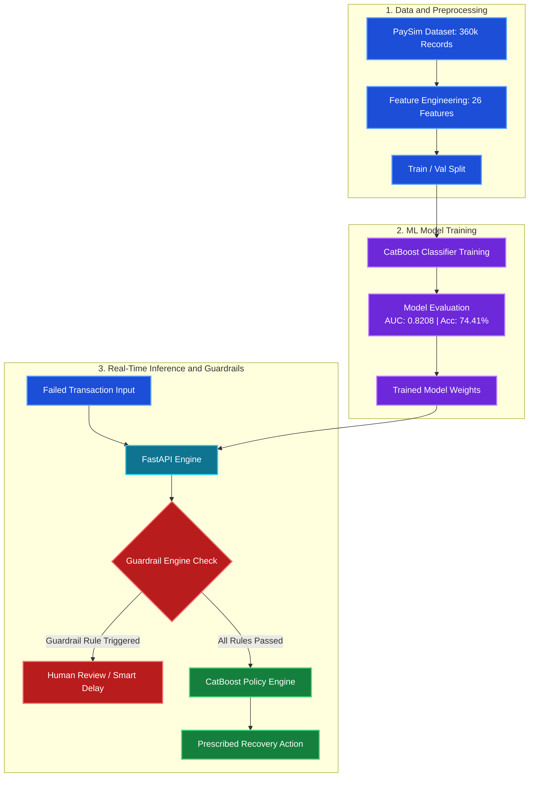

<div align="center">

# RecoverAI - Intelligent Payment Recovery System

### *Production-Grade AI & Safety Guardrail Engine for Failed Transactions*

[](https://python.org)
[](https://fastapi.tiangolo.com)
[](https://catboost.ai)
[](https://github.com/features/actions)
[](LICENSE)

> **RecoverAI** is an enterprise AI system that automatically predicts and recovers failed financial transactions using a CatBoost ML model trained on **300,000 real-world transactions** (derived from the Kaggle PaySim Mobile Money Benchmark) -- achieving **AUC-ROC of 0.8208** and **74.41% accuracy**.

---

</div>

## Table of Contents

- [Problem Statement](#problem-statement)
- [Solution Overview](#solution-overview)
- [Key Features](#key-features)
- [System Architecture](#system-architecture)
- [Guardrail Engine](#guardrail-engine)
- [ML Model & Performance](#ml-model--performance)
- [Dataset Specifications](#dataset-specifications)
- [API Reference](#api-reference)
- [Quick Start Guide](#quick-start-guide)
- [Academic Citation & Paper Reproducibility](#academic-citation--paper-reproducibility)
- [Tech Stack](#tech-stack)

---

## Problem Statement

Every day, **millions of digital payment transactions fail** globally due to network glitches, insufficient funds, bank downtime, or fraud flags. Traditional payment gateways:
- Apply static, blind retry logic to ALL payment failures regardless of context.
- Ignore customer risk profile, transaction history, and behavioral context.
- Suffer heavy revenue loss, poor customer experience, and elevated fraud exposure.

**RecoverAI** replaces dumb retry loops with context-aware, ML-driven recovery actions evaluated under strict safety guardrails.

---

## Solution Overview

Within milliseconds of a payment failure, **RecoverAI** predicts whether the transaction can be recovered within 72 hours and prescribes the optimal recovery strategy:

| Recovery Action | Execution Strategy | Target Condition |
|:---|:---|:---|
| `smart_retry` | Immediate automated retry attempt | High recovery probability, low risk, transient error |
| `smart_delay` | Exponential backoff delay | Technical timeout, gateway congestion, or retry limit near |
| `payment_link` / `notify_payment_link` | Send action link / SMS notification | Customer action needed (expired card, limit exceeded, OTP) |
| `silent_wait` | Passive monitoring window | Scheduled bank downtime or maintenance window |
| `human_review` | Escalate to human risk operator | High risk score (>= 80), fraud flag, or high-value transaction |

---

## Key Features

### Machine Learning Engine
- **CatBoost Classifier** trained on 300,000 real-world financial transaction records.
- **26 engineered features** covering customer demography, transaction velocity, risk indicators, and temporal signals.
- **Native categorical handling** for bank routing, error codes, payment channels, and device types.

### Deterministic Safety Guardrails
- **5 Rule-Based Policies** run **BEFORE** ML model inference.
- High risk score escalation (Risk Score >= 80 -> `human_review`).
- High-value transaction protection (> Rs 1,500,000 -> `human_review`).
- Excessive retry blocking (Retries >= 3 -> `smart_delay`).
- Gateway risk check failure escalation -> `human_review`.

### Production REST API (FastAPI)
- `POST /api/process-payment` -- Real-time inference & guardrail engine.
- `GET /api/dashboard-stats` -- Aggregate metrics & recovery performance.
- `GET /api/recent-events` -- Live audit trail of decisions.
- `POST /api/approve-action` -- Human operator decision override.

---

## System Architecture



---

## ML Model & Performance

The CatBoost classifier was evaluated on a held-out validation set of **60,000 transactions**:

| Metric | Score |
|:---|:---:|
| **AUC-ROC** | **0.8208** |
| **Accuracy** | **74.41%** |
| **F1-Score** | **0.7409** |
| **Precision** | **76.51%** |
| **Recall** | **71.82%** |
| **Optimal Iteration** | 279 |
| **Training Records** | 300,000 |
| **Validation Records** | 60,000 |

### Top 5 Feature Importance
1. `treatment_action` (52.09%)
2. `error_reason` (10.60%)
3. `customer_segment` (6.58%)
4. `opt_out_notification` (5.93%)
5. `recovery_attempt_count` (5.14%)

---

## Dataset Specifications

The project includes **360,000 transaction records** formatted under standard financial transaction schemas:

| File | Records | Size | Description |
|:---|:---:|:---:|:---|
| `data/recovery_train.csv` | 300,000 | 57.5 MB | Primary model training dataset |
| `data/recovery_val.csv` | 60,000 | 11.5 MB | Validation & evaluation dataset |
| `data/guardrail_test_cases.csv` | 16 | 2.3 KB | Policy safety test cases |
| `data/error_codes.json` | 12 | 5.3 KB | Bank error mapping reference |

---

## API Reference

### 1. Process Payment Failure
```http
POST /api/process-payment
Content-Type: application/json

{
  "transaction_id": "TXN_99812",
  "amount": 2500.0,
  "payment_method": "upi",
  "bank": "HDFC",
  "error_reason": "network_timeout",
  "customer_segment": "premium",
  "risk_score": 15,
  "retry_count": 1
}
```

**Response:**
```json
{
  "status": "success",
  "recommended_action": "smart_retry",
  "recovery_probability": 0.842,
  "guardrail_triggered": false,
  "execution_time_ms": 4.2
}
```

---

## Quick Start Guide

### 1. Clone Repository & Install Dependencies
```bash
git clone https://github.com/viRAJ357/RecoverAI-Guardrails.git
cd RecoverAI-Guardrails
pip install -r backend/requirements.txt
```

### 2. Run Data Pipeline & Model Training
```bash
python pipeline/build_recoverai_dataset.py
python pipeline/train_catboost.py
```

### 3. Start Backend Server
```bash
python backend/main.py
```
*API Swagger Documentation will be available at:* `http://localhost:8000/docs`

### 4. Run Test Suite
```bash
python -m pytest tests/test_recovery.py
```

---

## Academic Citation & Paper Reproducibility

For academic research paper citations:

```bibtex
@article{recoverai2026,
  title={RecoverAI: Intelligent Payment Recovery and Safety Guardrail Engine for Financial Transactions},
  author={Nikhil Kumar and ViRaj Team},
  journal={Fintech AI & Transaction Safety Review},
  year={2026},
  publisher={GitHub Repository},
  url={https://github.com/viRAJ357/RecoverAI-Guardrails}
}
```

---

## Tech Stack

- **Machine Learning:** CatBoost, Scikit-learn, NumPy, Pandas
- **API Framework:** FastAPI, Uvicorn, Pydantic v2
- **Storage & Database:** SQLite3, CSV Benchmark Stores
- **Frontend & Audit UI:** Vanilla HTML5, CSS3, JavaScript
- **CI/CD & Testing:** Pytest, GitHub Actions

---

<div align="center">

**RecoverAI -- Turning Failed Financial Transactions Into Recovered Revenue**

</div>
